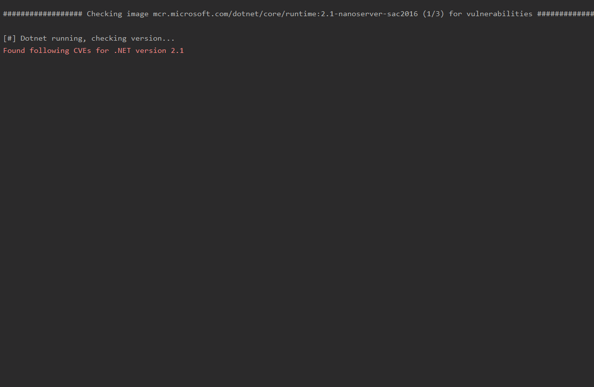

# Whalescan

Released as open source by NCC Group Plc - https://www.nccgroup.com/

Developed by Saira Hassan ([@saiber_saira](https://twitter.com/saiber_saira))

https://github.com/nccgroup/whalescan

Released under Apache license 2.0, see LICENSE for more information

## Introduction
Whalescan is a vulnerability scanner for Windows containers, which performs several benchmark checks, as well as checking for CVEs/vulnerable packages on the container. It also checks the config and Docker files for misconfigurations. This tool can be used as part of a Windows
container review on local copies of the containers, and on the host itself to enhance security.

## Getting Started


```
git clone https://github.com/saira-h/whalescan

pip install -r requirements.txt

./main.py
```

## Overview

Whalescan performs the following checks on containers:

* Container checks 

    * Checks if containers are stored under C: drive - this could raise issues if there is a DoS attack, 
    filling up the C: drive and making the host unresponsive
    * Checks if container is running as a process or hyper-v. Hyper-v isolation offers enhanced security of containers
    * Checks if there are any pending updates in the containers, and if so, how to update.
    
    
    
* Image checks
    * Checks for unsafe commands being used in the dockerfile, for example docker ADD instead of docker COPY. 
    * Checks if hash verification is being performed on any files downloaded.
    * Checks if any vulnerable packages are on the container, and pulls relevant CVE information
    * Checks if .NET version being used is End Of Life
    * Checks if Docker Engine is updated, and if not, gathers a list of CVEs for the version being used
    
    
    
* Checks permissions of docker configuration files 
* Checks if additional devices have been mapped to containers

